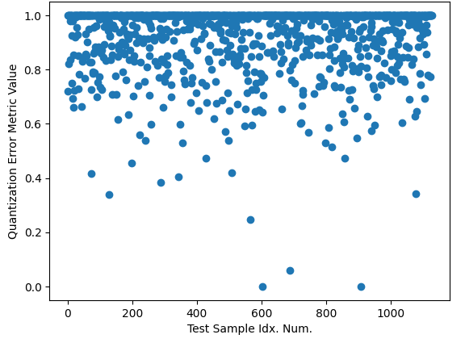
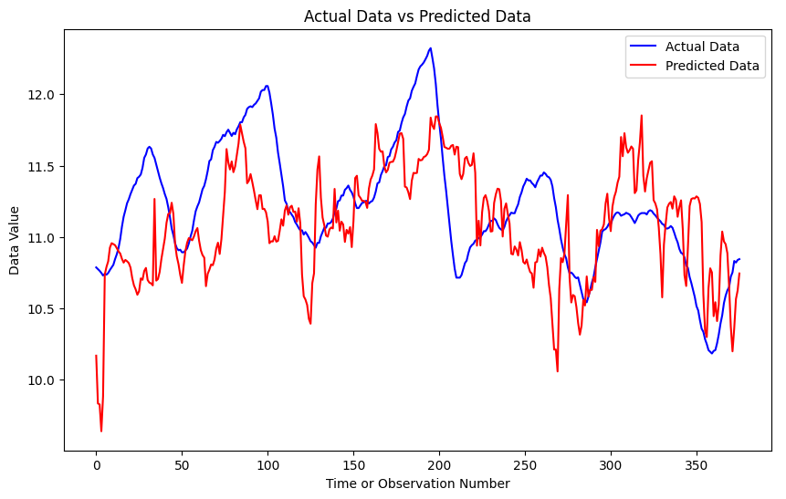

# `HVAC-predictive-control`

A Python package designed for handling and optimizing HVAC system data. It processes temperature and flow measurements, power usage, and solar irradiance to enhance system efficiency. The package features:
- Novelty/anomaly detection using SOM. 
- Predictive analysis employing ANFIS.

## Getting started

Run the following command for clonning the repository from GitHub:

```shell
git clone https://github.com/opticsensors/HVAC-predictive-control.git
```

Then:

1. Make sure  you have the latest version of pip and PyPA’s build installed:
   ```shell
   py -m pip install --upgrade pip
   py -m pip install --upgrade build
   ```

2. In your terminal, navigate to your new project, and initialise Git
   ```shell
   git init
   ```

3. Install the necessary packages using `pip`:
   ```shell
   py -m build
   py -m pip install -e .
   ```

4. Stage all your project files, and make your first commit
   ```shell
   git add .
   git commit -m "First commit"
   ```


## Directory structure
The project follows a tree structure similar to this cookiecutter [template][cookiecutter-template].

```
├── README.md                   <- The top-level README for developers using this project.
├── data               
│   ├── plots                   <- Generated plots for data analysis (correlation, frequency, and time series)
│   ├── interim                 <- Intermediate data that has been transformed.
│   ├── processed               <- The final, canonical data sets for modeling.
│   └── raw                     <- The original, immutable data dump.
│               
├── models                      <- Trained model weights
│               
├── notebooks                   <- Jupyter notebooks with quick and dirty code for concept testing, 
│                                  organized chronologically with project development.
│               
├── scripts                     <- Python scripts.
│   ├── anfis_implementations   <- Different ANFIS implementations found online.
│   ├── anfis_matlab            <- ANFIS implemented by MathWorks.
│   ├── final_results           <- Final scripts for preprocessing, decision plots, SOM and prediction.
│   ├── som_implementations     <- Different SOM implementations found online.
│   └── som_tune_param          <- Tunning SOM parameters.
│               
├── pyproject.toml              <- Makes project pip installable so src can be imported.               
│                                  The requirements are listed here.
│                
├── src                         <- Source code for use in this project.
│   └── hvac_control            
│       └── init__.py           <- Makes hvac_control a Python module that can be imported from everywhere.
│       └── anfis.py            <- Implements ANFIS in TensorFlow for data prediction.
│       └── data.py             <- Manages file paths and handles data load/save.
│       └── decision_plots.py   <- Analyzes and visualizes time series, correlations, and frequencies.
│       └── parameters.py       <- Defines repository and data directory paths relative to script location.
│       └── preprocessing.py    <- Process timeseries data w/ scaling, filtering, and time-based segmentation.
│       └── som_metrics.py      <- Analysis of SOM, including functions for BMU id and quantization error. 
│       └── som_novelty.py      <- KNN and Quantization Error-based anomaly detection methods.
│       └── som.py              <- Implements SOM in NumPy for multidimensional data clustering and mapping.
│       └── utils.py            <- Provides utility functions 
│
└── LICENSE.txt

```

## First preprocesing: data continuity

We load the `gaia_data.csv` file into a pandas DataFrame (`df`) and sequentially apply the following data processing steps:

1. Convert the 'time' column in `df` to a datetime format and rename it to 'datetime'.
2. Set this 'datetime' column as the new index of `df`.
3. Transform `df` to ensure a continuous time series, with a 1-minute interval between rows:
   - Split the DataFrame if there's a time jump larger than a specified threshold.
   - Insert rows filled with NaNs for smaller time gaps to maintain the 1-minute interval.

6. Retain only those rows where all sensors have recorded measurements, in line with their synchronized sampling intervals.
7. Split `df` again if there is a sequence of consecutive NaNs exceeding a defined threshold.
8. Fill the remaining NaNs in `df` using linear interpolation. Subsequently, discard any segments of `df` that are smaller than a predetermined size threshold.
9. Keep columns of interest.

This approach ensures that the DataFrame is structured with uniform time intervals and contains only complete and significant data segments for analysis. Hence, after this first step, we will have a list of potential DataFrames for posterior analyisis. 


## Second preprocesing: prediction dataset

We select the largest DataFrame from the previously obtained list of potential DataFrames and apply the following operations:

1. Filter the dataset columns of interest in order to reduce noise.

2. Augment the DataFrame by adding new columns, such as the difference between temperatures and the hour of the day. The latter is a categorical variable and will be encoded using sine and cosine functions.

3. Manually inspect the time series plots to identify and remove working days that exhibit atypical behavior compared to other working days.

4. Exclude all hours outside the operating window of the HVAC system. This includes:

   - Weekends and holidays.
   - Hours outside the 5:00 to 17:30 range. Note: The end time is set at 17:30 instead of 18:30 to enable the prediction of the target signal an hour ahead, i.e., at 18:30, which is the last operational hour.

5. Remove the datetime index from the DataFrame and add a 'day number' column. This new column will facilitate the train/test split of the dataset.

6. Keep columns of interest.

This structured approach ensures a dataset that is ready for modeling and analysis.


## Decision plots: 

Three types of plots have been developed to help with the creation of the dataset used for prediction purposes. These plots will be generated for each day in the selected DataFrame, as prepared in the previous preprocessing steps.

- **Time Series Plot**: This plot displays the temporal evolution of the dataset signals, focusing on the time frame from 5:00 to 18:30. It's particularly useful for visually inspecting the patterns and trends in the data across different times of the day.


- **Frequency Plot**: This plot involves the FFT of each signal of interest.  It helps in identifying dominant frequencies, periodicities, and any noise components. It can inform in filtering out noise or irrelevant frequencies.


- **Correlation Plot**: The correlation plot is designed to reveal how the various attribute signals correlate with the target signal. By examining the peaks in this plot, one can determine the optimal time lags for predictive modeling.


## SOM novelty detection

Self-Organizing Maps (SOMs) are a type of unsupervised neural network that are effective in mapping high-dimensional data onto a 2-dimensional grid. Each cell of the grid is a neuron that has the same dimensonality as the input data. This feature makes SOMs particularly useful for novelty detection in complex datasets, such as HVAC data.

- **Visualization with PCA**: The results of the SOM, when superimposed with the training data, can be visualized using PCA. This helps in reducing the dimensionality of the data while preserving its essential patterns, making it easier to interpret the SOM output.


- **Novelty Detection Metrics**:

   - **KNN Approach**: This method involves using the KNN algorithm to measure the distance of each data point to its neighbors in the SOM grid. The distances indicate how similar a data point is to the trained patterns. Larger distances can signify novel or anomalous data points.  Additionally, there is a filtering based on a minimum count criterion for BMUs.

   - **Quantization Error (QE)**: This method uses the QE and compares it with the mean QE resulting from the SOM training process. If it is equal or less than the mean, its associated metric is 0. On the other hand, a QE bigger than the distance between the two further matching units, dmax, represents a metric value of 1. Finally, a QE bigger than the mean, and lower than dmax, will result in a metric value between 0 and 1. Its interpretation is: the closer to 1 is the metric, the better.


KNN                        |            QE
:-------------------------:|:-------------------------:
|  


## ANFIS data prediction

Adaptive Neuro-Fuzzy Inference System (ANFIS) is a kind of artificial neural network that it is used for prediction and modeling purposes. In the given context, ANFIS is applied for predicting a temperature one hour into the future.

- **Cross-Validation Approach**: To enhance the reliability of the prediction, a cross-validation technique is employed. Specifically, a rotating 1-day testing period is used. This means the model is trained on a continuous dataset, except for a one-day period which is reserved for testing. The testing period then moves across the dataset, ensuring that the model is validated on different segments of the data.

- **Visualization**: The performance and predictions of the ANFIS model can be visualized as follows. This graphical representation shows the comparison between actual values and the predicted values by the ANFIS model.





[cookiecutter-template]: https://github.com/drivendata/cookiecutter-data-science
[this-practices]: https://scikit-learn.org/stable/developers/develop.html