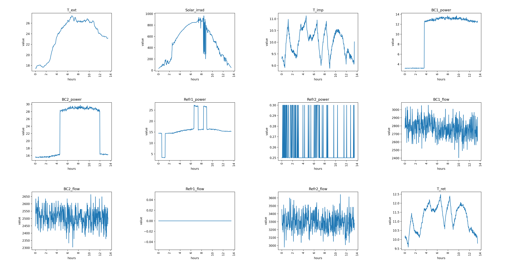
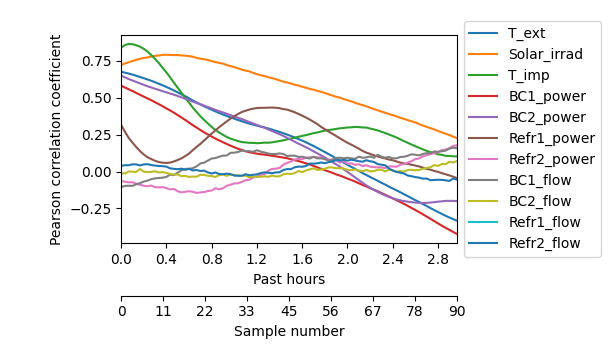

# `HVAC-predictive-control`

A Python package designed for handling HVAC system data. It processes temperature and flow measurements, power usage, and solar irradiance to optimize system efficiency. The package features:
- Novelty/anomaly detection using SOM. 
- Predictive analysis employing ANFIS.

## Getting started

Run the following command for clonning the repository from GitHub:

```shell
git clone https://github.com/opticsensors/HVAC-predictive-control.git
```

Then:

1. Make sure  you have the latest version of pip and PyPA’s build installed:
   ```shell
   py -m pip install --upgrade pip
   py -m pip install --upgrade build
   ```

2. In your terminal, navigate to your new project, and initialise Git
   ```shell
   git init
   ```

3. Install the necessary packages using `pip`:
   ```shell
   py -m build
   py -m pip install -e .
   ```

4. Stage all your project files, and make your first commit
   ```shell
   git add .
   git commit -m "First commit"
   ```


## Directory structure
The project follows a tree structure similar to this cookiecutter [template][cookiecutter-template].

```
├── README.md                   <- The top-level README for developers using this project.
├── data               
│   ├── plots                   <- Generated plots for data analysis (correlation, frequency, and time series)
│   ├── interim                 <- Intermediate data that has been transformed.
│   ├── processed               <- The final, canonical data sets for modeling.
│   └── raw                     <- The original, immutable data dump.
│               
├── models                      <- Trained model weights
│               
├── notebooks                   <- Jupyter notebooks with quick and dirty code for concept testing, 
│                                  organized chronologically with project development.
│               
├── scripts                     <- Python scripts.
│   ├── anfis_implementations   <- Different ANFIS implementations found online.
│   ├── anfis_matlab            <- ANFIS implemented by MathWorks.
│   ├── final_results           <- Final scripts for preprocessing, decision plots, SOM and prediction.
│   ├── som_implementations     <- Different SOM implementations found online.
│   └── som_tune_param          <- Tunning SOM parameters.
│               
├── pyproject.toml              <- Makes project pip installable so src can be imported.               
│                                  The requirements are listed here.
│                
├── src                         <- Source code for use in this project.
│   └── hvac_control            
│       └── init__.py           <- Makes hvac_control a Python module that can be imported from everywhere.
│       └── anfis.py            <- Implements ANFIS in TensorFlow for data prediction.
│       └── data.py             <- Manages file paths and handles data load/save.
│       └── decision_plots.py   <- Analyzes and visualizes time series, correlations, and frequencies.
│       └── parameters.py       <- Defines repository and data directory paths relative to script location.
│       └── preprocessing.py    <- Process timeseries data w/ scaling, filtering, and time-based segmentation.
│       └── som_metrics.py      <- Analysis of SOM, including functions for BMU id and quantization error. 
│       └── som_novelty.py      <- KNN and Quantization Error-based anomaly detection methods.
│       └── som.py              <- Implements SOM in NumPy for multidimensional data clustering and mapping.
│       └── utils.py            <- Provides utility functions 
│
└── LICENSE.txt

```

## First preprocesing: data continuity

We load the `gaia_data.csv` file into a pandas DataFrame (`df`) and sequentially apply the following data processing steps:

1. Convert the column with time info in `df` to a datetime format and rename it to 'datetime'.
2. Set this 'datetime' column as the new index of `df`.
3. Transform `df` to ensure a continuous time series, with a 1-minute interval between rows:
   - Split the DataFrame if there's a time jump larger than a specified threshold.
   - Insert rows filled with NaNs for smaller time gaps to maintain the 1-minute interval.

4. Retain only those rows where all sensors have recorded measurements, in line with their synchronized sampling intervals.
5. Split `df` again if there is a sequence of consecutive NaNs exceeding a defined threshold.
6. Fill the remaining NaNs in `df` using linear interpolation. Subsequently, discard any segments of `df` that are smaller than a predetermined size threshold.
7. Keep columns of interest.

This approach ensures that the DataFrame is structured with uniform time intervals and contains only complete and significant data segments for analysis. Hence, after this first step, we will have a list of potential DataFrames for posterior analyisis. The flow chart of the sequential steps involved in this preprocessing step is:


<details><summary><b>Example of use</b></summary>

1. Import libraries and data:

    ```python
   from hvac_control.data import load_data, save_data
   from hvac_control.preprocessing import *

   df = load_data("gaia_data.csv", data_type='raw', header_names=None)
    ```

2. Define variables for preprocessing and compute results:
    ```python

   x_columns = ['T_ext', 'Solar_irrad', 'T_imp', 
            'BC1_power', 'BC2_power', 'Refr1_power', 
            'Refr2_power', 'BC1_flow', 'BC2_flow', 
            'Refr1_flow', 'Refr2_flow']

   y_column = ['T_ret']

   all_columns = x_columns + y_column

   max_minutes=30
   rows_to_skip=2
   max_consecutive_nans=30
   thresh_len=1000

   dfs = first_preprocessing_step(df, max_minutes, rows_to_skip, max_consecutive_nans, thresh_len, all_columns)
   ```
3. Save resulting DataFrames

    ```python
   for num,df in enumerate(dfs):
      name = f'gaia_data_{num}.csv'
      save_data(df, name, data_type='interim', index=True)
   ```

</details>

## Second preprocesing: prediction dataset

We select the largest DataFrame from the previously obtained list of potential DataFrames and apply the following operations:

1. Filter the dataset columns of interest in order to reduce noise.

2. Augment the DataFrame by adding new columns, such as the difference between temperatures and the hour of the day. The latter is a categorical variable and will be encoded using sine and cosine functions.

3. Manually inspect the time series plots to identify and remove working days that exhibit atypical behavior compared to other working days.

4. Exclude all hours outside the operating window of the HVAC system. This includes:

   - Weekends and holidays.
   - Hours outside the 5:00 to 17:30 range. Note: The end time is set at 17:30 instead of 18:30 to enable the prediction of the target signal an hour ahead, i.e., at 18:30, which is the last operational hour.

5. Remove the datetime index from the DataFrame and add a 'day number' column. This new column will facilitate the train/test split of the dataset.

6. Keep columns of interest.

This structured approach ensures a dataset that is ready for modeling and analysis. The flow chart of the sequential steps involved in this preprocessing step is:


<details><summary><b>Example of use</b></summary>

1. Import libraries:

    ```python
   from hvac_control.data import load_data, save_data
   from hvac_control.preprocessing import *
    ```

2. Define variables for preprocessing:
    ```python
   columns_to_filter = ['T_ext', 'Solar_irrad', 'T_imp', 
                     'BC1_power', 'BC2_power', 'T_ret']    

   x_columns = ['Day', 'T_ext', 'Solar_irrad', 'T_imp', 
            'BC1_power', 'BC2_power', 'Diff_temp',
            'Hours_sin', 'Hours_cos', 'T_ret'] 

   y_column = ['T_ret_in_1h']

   all_columns = x_columns + y_column

   strating_hour = '05:00'
   ending_hour = '17:30'
   removed_day = '2022-05-25'
   kernel_size = 5
   projection = 30
   ```
3. Load data of first preprocessing step and save resulting DataFrames:

    ```python
   for num in range(11):
      name = f'gaia_data_{num}.csv'
      df = load_data(name, data_type='interim', header_names=None, index=True)
      df_processed = second_preprocessing_step(df, all_columns, columns_to_filter, strating_hour, ending_hour, removed_day, kernel_size, projection)
      save_data(df_processed, name, data_type='processed', index=False)

   ```

</details>

## Decision plots: 

Three types of plots have been developed to help with the creation of the dataset used for prediction purposes. These plots will be generated for each day in the selected DataFrame, as prepared in the previous preprocessing steps.

- **Time Series Plot**: This plot displays the temporal evolution of the dataset signals, focusing on the time frame from 5:00 to 18:30. It's particularly useful for visually inspecting the patterns and trends in the data across different times of the day. An example for day 1:



- **Frequency Plot**: This plot involves the FFT of each signal of interest.  It helps in identifying dominant frequencies, periodicities, and any noise components. It will be used for selecting the kind of filtering needed. An example for day 1:


- **Correlation Plot**: The correlation plot is designed to reveal how the various attribute signals correlate with the target signal. By examining the peaks in this plot, one can determine the optimal time lags for predictive modeling. An example for day 1:




## SOM novelty detection

Self-Organizing Maps (SOMs) are a type of unsupervised neural network that are effective in mapping high-dimensional data onto a 2-dimensional grid. Each cell of the grid is a neuron that has the same dimensonality as the input data. This feature makes SOMs particularly useful for novelty detection in complex datasets, such as HVAC data.

The output data from the first preprocessing step, after removing all non-working hours, is used for training. This data will be split into training and test sets randomly and then transformed using the mean and standard deviation of the training set.

- **Visualization with PCA**: The results of the SOM, when superimposed with the training data, can be visualized using PCA. This helps in reducing the dimensionality of the data while preserving its essential patterns, making it easier to interpret the SOM output.


- **Novelty Detection Metrics**:

   - **K-nearest neighbors (KNN)**: This method involves using the KNN algorithm to measure the distance of each data point to its neighbors in the SOM grid. The distances indicate how similar a data point is to the trained patterns.  Additionally, there is a filtering based on a minimum count criterion for BMUs.
      - **Interpretation**: Larger distances signify novel or anomalous data points.

   - **Quantization Error (QE)**: This method uses the QE and compares it with the mean QE resulting from the SOM training process. If it is equal or less than the mean, its associated metric is 0. On the other hand, a QE bigger than the distance between the two further matching units, dmax, represents a metric value of 1. Finally, a QE bigger than the mean, and lower than dmax, will result in a metric value between 0 and 1. Moreover, different ways of computing dmax are supported. 
      - **Interpretation**: The closer the metric is to 1, the less likely it is that the corresponding data point is an outlier.


KNN                        |            QE
:-------------------------:|:-------------------------:
|  

- **Visualization of Novelty Detection in Time-Series Data**: The outcomes of novelty detection are effectively identified and assessed using time-series plots. 


<details><summary><b>Example of use</b></summary>

1. Import libraries and data:

    ```python
   import pandas as pd
   from sklearn.model_selection import train_test_split
   from hvac_control.data import load_data
   from hvac_control.preprocessing import *
   from hvac_control.preprocessing import std_scaler_given_parameters
   from hvac_control.som import SOM
   from hvac_control.som_novelty import Quantization_Error

   data_to_load = "gaia_data_1.csv" # larger dataset
   df_index = load_data(data_to_load, data_type='interim', header_names=None, index=True)
    ```

2. Keep only working hours data points:
    ```python
   df_working = remove_specific_day(df_index, '2022-05-25')
   dfs_working = remove_non_working_hours(df_working, strating_hour='05:00', ending_hour='17:30')
   df_to_study = pd.concat(dfs_working)
   ```
3. Random split (there isn't a target column here):

    ```python
   X=df_to_study[all_columns].to_numpy()
   train_x, test_x = train_test_split(X, test_size=0.2, random_state=42)
   ```

4. Data transformation:

    ```python
   mu = train_x.mean(0)
   s = train_x.std(0)
   train_x_norm = std_scaler_given_parameters(train_x, mu, s)
   test_x_norm = std_scaler_given_parameters(test_x, mu, s)
   ```
5. Train SOM moodel:

    ```python
   model=SOM(som_grid_size=(12,12),
            max_distance=6,
            learning_rate_0=0.5,
            max_iter=100000,
            random_state=0,
            sigma_0=1, 
            sigma_decay=0.0005,
            learning_rate_decay=0.0005,
            methods={'init_som': 'uniform',
                     'bmu_distance': 'cityblock',
                     'compute_neighborhood': 'ceil',
                     'update_sigma_and_learning_rate': 'linear'}) 
   model=model.fit(train_x_norm, epochs=8)
   som=model.som
   som_dataset=som.reshape(-1,som.shape[2])
   ```

6. Novelty detection:

    ```python
   thresh=0.25
   model1=Quantization_Error(som, 'worst')
   metric1=model1.evaluate(train_x_norm, test_x_norm)
   print(list(np.where(metric_eq1<thresh)))
   ```

</details>

## ANFIS data prediction

Adaptive Neuro-Fuzzy Inference System (ANFIS) is a kind of artificial neural network that it is used for prediction and modeling purposes. In the given context, ANFIS is applied for predicting a temperature one hour into the future.

The output data from the second preprocessing step is used for training. This data will be divided into training and test sets, and then transformed using the mean and standard deviation of the training set.

- **Cross-Validation Approach**: To enhance the reliability of the prediction, a cross-validation technique is employed. Specifically, a rotating 1-day testing period is used. This means the model is trained on a continuous dataset, except for a one-day period which is reserved for testing. The testing period then moves across the dataset, ensuring that the model is validated on different segments of the data.

- **Visualization**: The performance and predictions of the ANFIS model can be visualized as follows. This graphical representation shows the comparison between actual values and the predicted values by the ANFIS model.

For instance, the obtained results using a dataset of 15 days (the first 14 for training and the last one for testing) are shown below:


<details><summary><b>Example of use</b></summary>

1. Import libraries and data:

    ```python
   from hvac_control.data import load_data
   from hvac_control.preprocessing import std_scaler_given_parameters
   from hvac_control.anfis import ANFIS

   data_to_load = "gaia_data_1.csv" # larger dataset
   data = load_data(data_to_load, data_type='processed')
    ```

3. Cross validation split:

    ```python
   x_columns = ['T_ext', 'Solar_irrad', 'T_imp', 
            'BC1_power', 'BC2_power', 'Diff_temp',
            'Hours_sin', 'Hours_cos', 'T_ret'] 

   y_column = ['T_ret_in_1h']

   day_for_test = 1
   data_for_train = data[data['Day'] != day_for_test]
   data_for_test = data[data['Day'] == day_for_test]

   train_x = data_for_train[x_columns]
   train_y = data_for_train[y_column]

   test_x = data_for_test[x_columns]
   test_y = data_for_test[y_column]

   ```

4. Data transformation:

    ```python
   mu_x = train_x.mean(0)
   s_x = train_x.std(0)
   mu_y = train_y.mean(0)
   s_y = train_y.std(0)

   train_x_norm = std_scaler_given_parameters(train_x, mu_x, s_x)
   test_x_norm = std_scaler_given_parameters(test_x, mu_x, s_x)
   train_y_norm = std_scaler_given_parameters(train_y, mu_y, s_y)
   test_y_norm = std_scaler_given_parameters(test_y, mu_y, s_y)
   ```

5. Train ANFIS moodel:

    ```python
   n_inputs = train_x_norm.shape[1]
   n_rules = 16
   lr = 1e-4
   epochs = 150
   batch_size = 32

   fis = ANFIS(n_inputs=n_inputs, n_rules=n_rules, learning_rate=lr, mf='gbellmf',defuzz_method='linear', loss_fun='huber', init_method='normal')
   fis.compile(run_eagerly=True)

   # For training
   fis.fit(train_x_norm, train_y_norm, epochs=epochs, batch_size=batch_size)

   # For evaluation
   val_loss = fis.evaluate(test_x_norm, test_y_norm)
   print("Validation loss:", val_loss)
   ```

5. Temperature prediction:

    ```python
   input_data = test_x_norm.to_numpy() 
   time = np.arange(0,len(test_y_norm))

   # Generate predictions
   predicted_data = fis.predict(input_data)

   a=s_y*test_y_norm+mu_y
   predicted_data_df = pd.DataFrame()
   predicted_data_df['T_ret_in_1h']=pd.Series(predicted_data)
   b=s_y*predicted_data_df+mu_y

   error_sum = (np.sum(abs(a.to_numpy()-b.to_numpy())))
   error_avg = (np.mean(abs(a.to_numpy()-b.to_numpy())))
   error_max = (np.max(abs(a.to_numpy()-b.to_numpy())))
   ```

</details>


## LSTM data prediction

The Long Short-Term Memory (LSTM) network is a type of recurrent neural network specifically designed to capture long-term dependencies. It is widely used for sequence prediction problems, such as time series forecasting. In this context, the LSTM model is also applied for predicting temperature one hour into the future.

The process involves dividing the output data from the second preprocessing step into training and test sets, normalizing these sets using the training set's mean and standard deviation. Additionally, it organizes the data into sequences based on time order, using past data points.

Following the structure used for the ANFIS model, the LSTM model applies a cross-validation approach and the results are visualized in a similar way. For instance, the predictions using a dataset of 15 days (the first 14 for training and the last one for testing) are shown below:


<details><summary><b>Example of use</b></summary>

1. Import libraries and data:

    ```python
   import numpy as np
   import tensorflow as tf
   from keras.preprocessing.sequence import TimeseriesGenerator
   from hvac_control.data import load_data
   from hvac_control.preprocessing import std_scaler_given_parameters

   data_to_load = "gaia_data_1.csv" # larger dataset
   data = load_data(data_to_load, data_type='processed')
    ```

3. Cross validation split:

    ```python
   x_columns = ['T_ext', 'Solar_irrad', 'T_imp', 
            'BC1_power', 'BC2_power', 'Diff_temp',
            'Hours_sin', 'Hours_cos', 'T_ret'] 

   y_column = ['T_ret_in_1h']

   day_for_test = 1
   data_for_train = data[data['Day'] != day_for_test]
   data_for_test = data[data['Day'] == day_for_test]

   train_x = data_for_train[x_columns]
   train_y = data_for_train[y_column]

   test_x = data_for_test[x_columns]
   test_y = data_for_test[y_column]

   ```

4. Data transformation:

    ```python
   mu_x = train_x.mean(0)
   s_x = train_x.std(0)
   mu_y = train_y.mean(0)
   s_y = train_y.std(0)

   train_x_norm = std_scaler_given_parameters(train_x, mu_x, s_x)
   test_x_norm = std_scaler_given_parameters(test_x, mu_x, s_x)
   train_y_norm = std_scaler_given_parameters(train_y, mu_y, s_y)
   test_y_norm = std_scaler_given_parameters(test_y, mu_y, s_y)
   ```
5. Data transformation:

    ```python
   win_length=45
   batch_size=32
   num_features=train_x_norm.shape[1]
   epochs=150

   train_x_arr=train_x_norm.to_numpy()
   train_y_arr=train_y_norm.to_numpy()
   test_x_arr=test_x_norm.to_numpy()
   test_y_arr=test_y_norm.to_numpy()

   train_generator = TimeseriesGenerator(train_x_arr, train_y_arr, length=win_length, sampling_rate=1, batch_size=batch_size)
   test_generator = TimeseriesGenerator(test_x_arr, test_y_arr, length=win_length, sampling_rate=1, batch_size=batch_size)
   ```

5. Train LSTM moodel:

    ```python
   model = tf.keras.Sequential()
   model.add(tf.keras.layers.LSTM(128, input_shape=(win_length, num_features), return_sequences=True))
   model.add(tf.keras.layers.LeakyReLU(alpha=0.5))
   model.add(tf.keras.layers.LSTM(128, return_sequences=True))
   model.add(tf.keras.layers.LeakyReLU(alpha=0.5))
   model.add(tf.keras.layers.Dropout(0.3))
   model.add(tf.keras.layers.LSTM(64, return_sequences=False))
   model.add(tf.keras.layers.Dropout(0.3))
   model.add(tf.keras.layers.Dense(1))

   model.compile(loss=tf.losses.MeanSquaredError(),
              optimizer=tf.optimizers.Adam(),
              metrics=[tf.metrics.MeanAbsoluteError()])

   history = model.fit_generator(train_generator, epochs=epochs,
                                 validation_data=test_generator,
                                 shuffle=False,)

   model.evaluate_generator(test_generator, verbose=0)

   predictions = model.predict_generator(test_generator)
   ```

5. Temperature prediction:

    ```python
   model.evaluate_generator(test_generator, verbose=0)
   predictions = model.predict_generator(test_generator)
   predictions.shape[0]

   time = np.arange(0,len(test_y_norm[:-win_length]))
   a=s_y*test_y_norm+mu_y
   predicted_data_df = pd.DataFrame()
   predicted_data_df['T_ret_in_1h']=pd.Series(predictions.ravel())
   b=s_y*predicted_data_df+mu_y
   a=a.iloc[:-win_length]

   error_sum = (np.sum(abs(a.to_numpy()-b.to_numpy())))
   error_avg = (np.mean(abs(a.to_numpy()-b.to_numpy())))
   error_max = (np.max(abs(a.to_numpy()-b.to_numpy())))
   ```

</details>


[cookiecutter-template]: https://github.com/drivendata/cookiecutter-data-science
[this-practices]: https://scikit-learn.org/stable/developers/develop.html